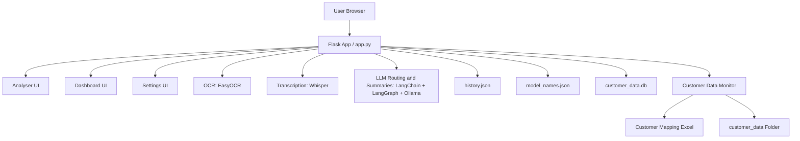

# Interjet Support Analyser

Interjet Support Analyser is a Flask-based ISP support workspace that can analyse uploaded screenshots and audio, route issues through a LangGraph workflow, and continuously monitor a configurable `customer_data` folder into SQLite.

## What It Does

- Manual analysis of one customer interaction at a time.
- OCR for screenshots using EasyOCR.
- Transcription for audio using Whisper.
- Routed issue classification and specialist handling with LangChain + LangGraph.
- Human review gate for uncertain cases.
- Approval-based operational actions for supported issue categories.
- Background customer-data monitoring from a root folder plus Excel mapping.
- SQLite persistence for monitored records, payments, and runtime status.
- Live dashboard, compact settings page, and collapsible sidebar UI.

## Key Features

- **Analyser**: Upload audio and/or screenshots, choose the active models, and review the routed LangGraph trace.
- **Dashboard**: View monitor health, manual history, monitored customer records, matched payments, and approvals.
- **Settings**: Configure the customer data folder, Excel mapping file, monitor interval, and default models.
- **Customer Monitor**: Watches subfolders, skips duplicates by content hash, and stores results in SQLite.
- **Live Status**: Shows processing progress, last scan details, and current monitor state in the UI.
- **Approvals**: Supports approve/reject flows for manual history and monitored actions.

## Architecture Overview



## Technology Stack

- **Backend**: Flask, Flask-Cors
- **Workflow Orchestration**: LangChain, LangGraph, Ollama
- **Speech / OCR**: Whisper, EasyOCR
- **Data Storage**: JSON for history and model defaults, SQLite for customer monitoring
- **Frontend**: HTML, JavaScript, Bootstrap 5, Bootstrap Icons
- **Utilities**: openpyxl for Excel mapping, psutil for system metrics

## Project Layout

- `app.py` - Flask backend, LangGraph workflow, APIs, and monitor service
- `index.html` - Single-page UI for Analyser, Dashboard, and Settings
- `Home.py` - Placeholder entry point from earlier iterations
- `history.json` - Stored analysis history
- `model_names.json` - Default model names and monitor configuration
- `customer_data.db` - SQLite database created at runtime for monitored intake
- `Start_Server.ps1` - Windows startup script
- `start_server.sh` - Linux/macOS startup script

## Prerequisites

- Python 3.11
- Ollama installed and running locally
- FFmpeg available on PATH
- Optional: NVIDIA GPU with CUDA for faster processing

## Installation

### Windows

1. Open PowerShell in the project folder.
2. Run:
   ```powershell
   .\Start_Server.ps1
   ```
3. The script validates the environment, creates a virtual environment, installs dependencies, and starts the app.

### Linux / macOS

1. Create and activate a virtual environment:
   ```bash
   python3 -m venv .venv
   source .venv/bin/activate
   ```
2. Install dependencies:
   ```bash
   pip install -r requirements.txt
   ```
3. Start the app:
   ```bash
   python3 app.py
   ```

## Configuration

Use the Settings page to configure:

- Customer Data Folder
- Customer Mapping Excel
- Monitor Interval
- Default Whisper Model
- Default Agent Model

The monitor watches the configured root folder for subfolders containing screenshots and audio. Folder names are matched against the Excel mapping, then persisted to SQLite.

## Customer Monitor Workflow

1. The monitor scans the configured root folder.
2. Each file is fingerprinted using SHA-256 content hashing.
3. Duplicate content is skipped even if the file name changes.
4. The Excel mapping resolves folder names to customer and account data.
5. Records are stored in `customer_data.db`.
6. Matched payments and operational actions are surfaced in the Dashboard.

## API Endpoints

- `POST /api/process` - Run the routed analysis workflow for manual uploads.
- `GET /api/history` - Read stored manual analysis history.
- `GET /api/system-info` - Read current CPU, RAM, storage, and GPU status.
- `GET /api/monitor/status` - Read live monitor status and statistics.
- `POST /api/monitor/scan-now` - Trigger an immediate customer-data scan.
- `GET /api/monitor/artifacts` - Read monitored customer records.
- `GET /api/monitor/payments` - Read matched payments.
- `GET /api/config` - Read saved settings.
- `POST /api/config` - Save settings.
- `POST /api/browse/folder` - Open a folder picker.
- `POST /api/browse/excel` - Open an Excel picker.

## Analysis Flow

The manual analysis path is routed through LangGraph:

1. Image preprocessing and OCR
2. Audio transcription
3. Issue classification and specialist routing
4. Summary generation
5. Review gate when confidence is low or billing evidence needs verification
6. Optional approval-driven action execution
7. History persistence and UI trace output

## Notes

- The sidebar is collapsible on desktop and stays icon-only in compact mode.
- Live monitor status is shown in the Dashboard and in the sidebar.
- The app keeps analysis history separate from monitored customer intake.

## Changelog

- **LangGraph migration**: The analysis flow now routes through LangGraph with issue classification, specialist routing, review gates, and approval-driven actions.
- **Customer monitor**: Added a background monitor for the configurable `customer_data` folder with Excel-based mapping, duplicate skipping by content hash, and SQLite persistence.
- **Dashboard updates**: The Dashboard now surfaces live monitor status, monitored records, matched payments, and approval controls.
- **Settings redesign**: Settings was simplified into a compact configuration-first page with browse actions for the folder and Excel mapping.
- **Sidebar polish**: The sidebar now supports desktop collapse with a centered icon toggle and compact live status rendering.

## Support Files

- `requirements.txt` - Python dependencies
- `pyproject.toml` - Build metadata
- `skill.md` - Workspace guidance used by the agent

If you want, I can also add a short changelog section so the README documents the recent agent, monitor, and UI redesigns in release-note style.